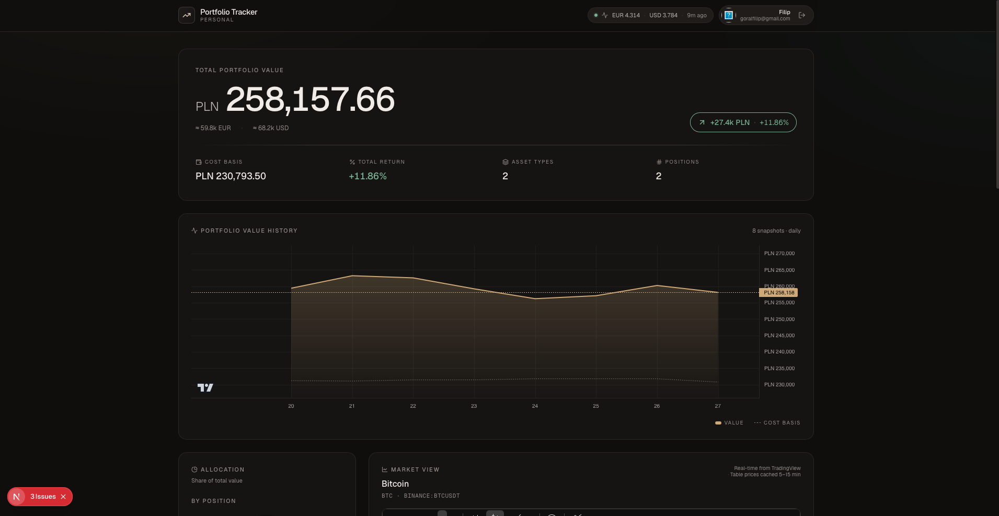
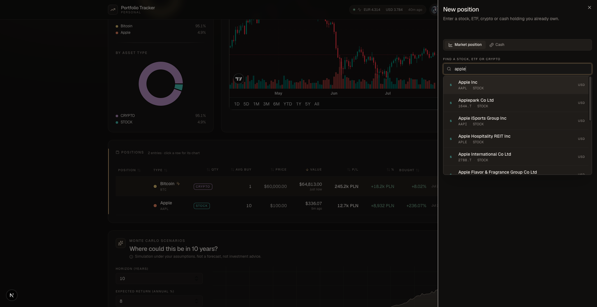
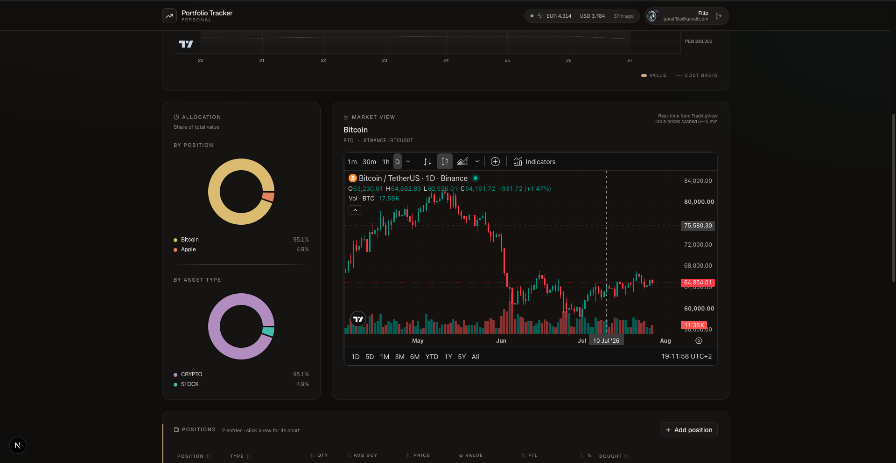
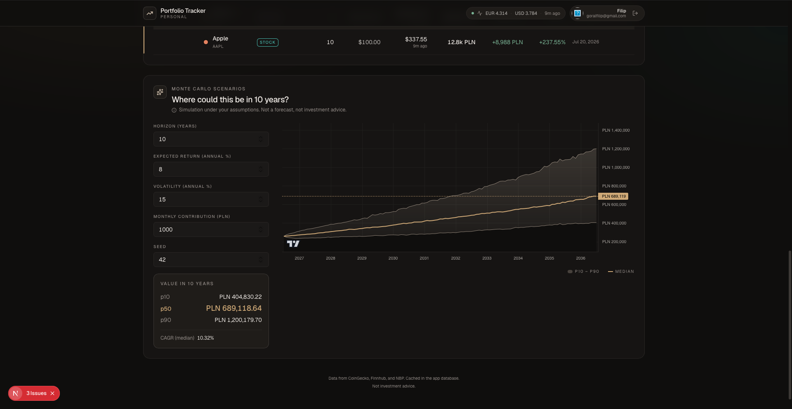

# Portfolio Tracker

A multi-user investment portfolio tracker for stocks, ETFs, crypto and cash across
multiple currencies. Built as both a daily-use tool for me and my friends, and a
portfolio piece exploring auth, multi-tenant data isolation, external APIs, FX
conversion, and financial visualization.

**Live demo:** https://portfolio-tracker-iota-one.vercel.app

> Access is gated by a Google sign-in allowlist. If you would like to try the demo
> with your own portfolio, ask the owner to add your email.

## Screenshots



| Unified ticker search | Allocation + live market view |
| --- | --- |
|  |  |



## Stack

- Next.js 16 (App Router) + TypeScript
- Tailwind CSS v4
- Prisma 6 + Neon Postgres
- Auth.js (NextAuth) v5 with Google, JWT sessions, email allowlist
- Recharts (allocation donut), TradingView Lightweight Charts (portfolio history),
  TradingView widgets (per-asset market view)
- Vitest for the pure finance and simulation logic
- Deployed on Vercel with automatic deploys from `main`

## Features shipped

- Add, edit and delete portfolio positions (stocks, ETFs, crypto, cash)
- Unified ticker search: type a company name or ticker and get a typeahead that
  merges Finnhub (stocks/ETFs) and CoinGecko (crypto); picking a result fills the
  ticker, name and asset type. Real ARIA combobox (keyboard nav, `aria-activedescendant`),
  300 ms debounce, 60 s server-side result cache, deduped results, and relevance
  ranking that keeps real equities and top coins above coincidental-ticker memecoins
- Portfolio summary: total value, cost and P/L in PLN plus EUR/USD preview
- Sortable positions table with per-position P/L
- Live market data from CoinGecko (crypto) and Finnhub (stocks and ETFs)
- NBP table A for FX rates
- Installable PWA (web app manifest, generated icon set, and a service worker
  that caches immutable build assets while never masking a new deploy)
- DB-backed price and FX cache with per-source TTL (crypto 5 min, stocks 15 min, FX 1 h)
- Tiered fallback: live API -> DB cache -> hardcoded constants (only when DB is empty)
- "as of X ago" freshness per source, red badge when stale

### Cache impact (measured after Stage 4)

Public SSR page fetching three third-party APIs per render is a footgun; the DB
cache exists to shield the free-tier quotas from every visitor pressing F5.

| Scenario | Load time | External calls |
|----------|-----------|----------------|
| Cold (empty cache) | 447 ms | Finnhub + CoinGecko + NBP |
| Warm (fresh cache) | 72 ms | 0 |

With Finnhub capped at 60 requests / minute on the free tier, this brings the
per-ticker rate to at most one call per TTL window, independent of traffic.

## Roadmap

- [x] Stage 0. Project scaffold with dark fintech theme
- [x] Stage 1. Prisma schema and positions CRUD
- [x] Stage 2. Summary card, sortable table, finance and format helpers
- [x] First deploy to Vercel (Neon Postgres)
- [x] Stage 3. Real market data (CoinGecko, Finnhub) and NBP FX rates
- [x] Stage 4. Price and FX cache in DB with tiered fallback
- [x] Stage 4.5. Auth (Google) and multi-user with email allowlist
- [x] Stage 5. Allocation donut + TradingView widget for the selected position
- [x] Stage 6. Daily snapshots per user + portfolio value chart (Lightweight Charts)
- [x] Stage 6.5. Monte Carlo scenario simulator
- [x] Stage 7. Design polish + responsiveness
- [x] Stage 8. Unit tests (Vitest), screenshots, final README
- [x] Stage 9. PWA (manifest, generated icons, service worker) — installable

## Local development

```bash
npm install
cp .env.example .env       # then fill in the values (see below)
npx prisma migrate deploy
npm run dev
```

Requires a Postgres instance. Neon free tier works out of the box.

Environment variables (all documented in `.env.example`):

| Variable | Purpose |
|----------|---------|
| `DATABASE_URL` | Neon / Postgres connection string |
| `FINNHUB_API_KEY` | Stock and ETF quotes + ticker search (free tier) |
| `AUTH_SECRET` | Auth.js JWT encryption key (`npx auth secret`) |
| `AUTH_GOOGLE_ID` / `AUTH_GOOGLE_SECRET` | Google OAuth credentials |
| `ALLOWED_EMAILS` | Comma-separated sign-in allowlist |
| `CRON_SECRET` | Shared secret for the daily-snapshot cron (prod only) |

The dashboard is behind sign-in, so the Google OAuth vars and `ALLOWED_EMAILS`
are needed to view it locally.

## Testing

Vitest covers the pure logic — no database or network required.

```bash
npm test           # run once
npm run test:watch # watch mode
```

Suites: `finance` (PLN conversion, P/L, portfolio totals), `fx` (conversions and
divide-by-zero guards), `simulator` (deterministic seeded RNG, percentile
interpolation, an ordered p10 ≤ p50 ≤ p90 fan) and `search` (relevance ranking
and result de-duplication).

## What I have learned so far

- Prisma 7 dropped the built-in database connection in favor of driver adapters
  or Prisma Accelerate. For a solo portfolio project this added enough friction
  that downgrading to Prisma 6 was the pragmatic choice.
- Fire-and-forget writes (`void writeCache(...)`) do not survive the render
  boundary in Next.js Server Components. The Vercel runtime tears down after the
  response finishes and pending microtasks may never execute. Always `await`.
- SQLite is not viable on Vercel serverless (read-only filesystem). Neon Postgres
  used both locally and in production kept the stack single-provider.
- Framework-level `next.revalidate` is not a substitute for a DB cache when the
  goal is protecting a third-party rate limit. It varies by region and cache key.
